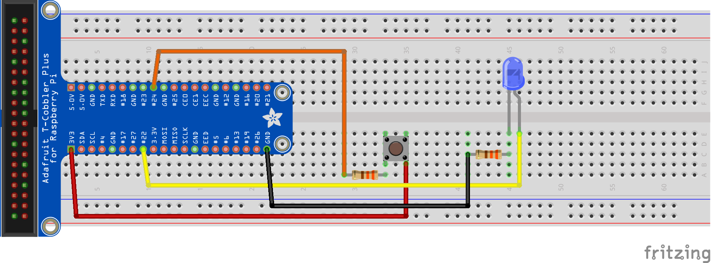

 Pi4J V2 :: Java I/O Library for Raspberry Pi :: JavaFX example application
===========================================================================

[](https://github.com/Pi4J/pi4j-example-javafx/actions/workflows/maven.yml)

This project contains an example application which uses the Pi4J (V2) library in combination
with JavaFX. Full description is available on [the Pi4J website](https://v2.pi4j.com/getting-started/user-interface-with-javafx/).

## PROJECT OVERVIEW


## WIRING

The application needs a LED connected on BCM 22 and button on BCM 24. 



## RUNTIME DEPENDENCIES

This project uses Pi4J V.2 which has the following runtime dependency requirements:
- [**SLF4J (API)**](https://www.slf4j.org/)
- [**SLF4J-SIMPLE**](https://www.slf4j.org/)
- [**PIGPIO Library**](http://abyz.me.uk/rpi/pigpio) (for the Raspberry Pi) - This 
dependency comes pre-installed on recent Raspbian images.  However, you can also 
download and install it yourself using the instructions found 
[here](http://abyz.me.uk/rpi/pigpio/download.html).

As this application has a JavaFX user interface, the project requires the OpenJFX runtime. When the package is build,
then the runtime is downloaded and added to the distribution directory.

## BUILD DEPENDENCIES & INSTRUCTIONS

This project can be built with [Apache Maven](https://maven.apache.org/) 3.6 (or later) and Java 17 OpenJDK (or later).
These prerequisites must be installed prior to building this project. The following command can be used to download all
project dependencies and compile the Java module. You can build this project directly on a Raspberry Pi with Java 17+.

```bash
mvn clean package
```

### Compiled application to run on the Raspberry Pi

Once the build is complete and was successful, you can find the compiled artifacts in the `target` folder. Specifically
all dependency modules (JARs) and a simple `run.sh` bash script will be located in the `target/distribution` folder.
This folder contains all the required files needed to distribute (copy) to your Raspberry Pi to run this project.

For your convenience, this `distribution` folder is zipped up, and is also located in the `target/` folder. Copy this
file to your Raspberry Pi, for example with the following command:

```bash
rsync target/pi4j-example-fxgl-0.0.1.zip pi@192.8.0.124:.
```

Then on the Raspberry Pi unzip the file with the following command:

```bash
unzip pi4j-example-fxgl-0.0.1.zip
```

Now the example can be started with the following command:

```bash
cd pi4j-example-fxgl-0.0.1/
./run.sh
```

*Note:* If you are using the native bindings running locally on the Raspberry Pi, then you may have to run the program
using `sudo` to gain the necessary access permissions to the hardware I/O.

This is the list of files created by the build process of this example application:

* pi4j-core
* pi4j-example-javafx
* pi4j-library-pigpio
* pi4j-plugin-pigpio
* pi4j-plugin-raspberrypi
* slf4j-api
* slf4j-simple
* javafx-*
* and additional dependencies required for JavaFX and FXGL
* run.sh --> this is the actual start file which will run pi4j-example-javafx

## LICENSE

 Pi4J Version 2.0 and later is licensed under the Apache License,
 Version 2.0 (the "License"); you may not use this file except in
 compliance with the License.  You may obtain a copy of the License at:
      http://www.apache.org/licenses/LICENSE-2.0

 Unless required by applicable law or agreed to in writing, software
 distributed under the License is distributed on an "AS IS" BASIS,
 WITHOUT WARRANTIES OR CONDITIONS OF ANY KIND, either express or implied.
 See the License for the specific language governing permissions and
 limitations under the License.

